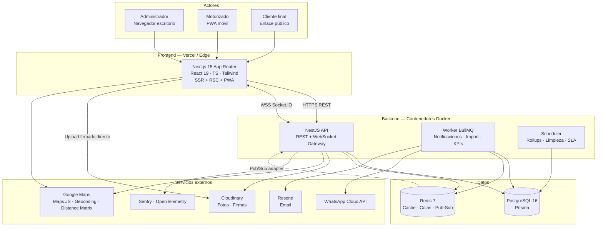

# 1. Arquitectura

## 1.1 Contexto y dimensionamiento

Antes de elegir tecnología, dimensiono el problema. Esto determina qué arquitectura es **profesional** y cuál es **sobre-ingeniería**.

| Variable | Estimación | Implicación |
|---|---|---|
| Pedidos importados / día | 100 – 1.000 | Un único Postgres cubre años de operación |
| Motorizados concurrentes | 5 – 50 | Sin necesidad de sharding |
| Pings GPS | 1 cada 10 s × motorizado × ~8 h | ~144k filas/día con 50 motorizados → tabla particionada + retención |
| Clientes viendo tracking | 1 – 3 por pedido en ruta | WebSocket con fan-out por sala; picos de ~500 conexiones |
| Escritura pico | Baja (importación diaria + eventos) | No requiere colas de alto throughput |
| Lectura pico | Media (dashboard + tracking) | Cache Redis + read-model denormalizado |

**Conclusión de arquitecto:** microservicios, Kafka o event-sourcing completo serían sobre-ingeniería y aumentarían el costo operativo sin beneficio. La decisión correcta es un **monolito modular** con fronteras de módulo explícitas, desplegable como una sola unidad pero **escalable horizontalmente sin estado** y **separable en servicios** el día que haga falta (los módulos ya están aislados por contrato).

---

## 1.2 Vista general (C4 — Nivel 2: Contenedores)



---

## 1.3 Decisiones de arquitectura (ADR resumidos)

### ADR-001 — Monorepo con pnpm workspaces + Turborepo
**Decisión:** un solo repositorio con `apps/web`, `apps/api`, `packages/shared`.
**Motivo:** los tipos del dominio (estados, DTOs, contratos de eventos WebSocket) se comparten entre front y back. Un monorepo elimina la desincronización de contratos, que es la fuente #1 de bugs en apps con tracking en tiempo real.
**Consecuencia:** el `index.html` actual (Guayoyo · Ventas) se preserva en `legacy/` — **requiere tu aprobación explícita antes de moverlo**.

### ADR-002 — Monolito modular en NestJS, no microservicios
**Decisión:** un proceso API + un proceso worker. Módulos con frontera dura: prohibido importar el servicio de otro módulo directamente; se comunica por puertos (interfaces) o por eventos internos.
**Motivo:** el volumen no justifica red entre servicios. Mantiene transacciones ACID en operaciones críticas (asignar 40 pedidos a una ruta debe ser atómico).

### ADR-003 — Arquitectura hexagonal ligera por módulo
Cada módulo de negocio se estructura en tres capas:

```
orders/
├── domain/          # Entidades, value objects, máquina de estados, reglas puras. CERO dependencias.
├── application/     # Casos de uso (un archivo = un caso de uso). Orquesta. Depende de puertos.
└── infrastructure/  # Controllers HTTP, repositorios Prisma, gateways WS, adaptadores externos.
```

**Motivo (SOLID):**
- **S** — un caso de uso por clase, una razón para cambiar.
- **D** — la aplicación depende de `OrderRepositoryPort`, no de Prisma. Los tests unitarios corren sin base de datos.
- **O** — añadir un canal de notificación (SMS) = implementar `NotificationChannelPort`, sin tocar código existente.

### ADR-004 — Los eventos son la fuente de verdad; los timestamps del pedido son read-model
**Decisión:** cada cambio de estado escribe una fila inmutable en `order_event`. Además, se **denormalizan** los timestamps clave sobre `order` (`assignedAt`, `dispatchedAt`, `deliveredAt`…) dentro de la misma transacción.
**Motivo:** los indicadores que pides (tiempo importación→asignación, etc.) son diferencias entre timestamps. Calcularlos con agregaciones sobre el log de eventos en cada carga del dashboard no escala; denormalizar da consultas de una sola tabla e índices simples. El log de eventos garantiza auditoría y permite **recalcular** el read-model si aparece un bug.
**Consecuencia:** invariante a testear — el read-model siempre debe poder reconstruirse desde los eventos.

### ADR-005 — GPS en tiempo real vía WebSocket con degradación a polling
**Decisión:** Socket.IO con adaptador Redis. Salas: `route:{id}` (admin), `order:{trackingToken}` (cliente), `admin:live` (mapa global).
**Motivo:** WebSocket evita ~1 request HTTP cada 3 s por cliente. El adaptador Redis permite correr N réplicas de la API detrás de un balanceador sin perder mensajes.
**Degradación:** si el WS falla (redes móviles peruanas, proxies corporativos), el cliente cae automáticamente a `GET /public/tracking/:token` cada 10 s. Nunca pantalla en blanco.

### ADR-006 — Escritura de GPS desacoplada de la lectura
El motorizado emite un ping cada 10 s. Ese ping:
1. Se escribe en **Redis** (`driver:{id}:position`, TTL 5 min) → lectura instantánea, sin tocar Postgres.
2. Se difunde por WebSocket a las salas suscritas.
3. Se acumula en un buffer y se persiste en lote (cada 30 s o 20 pings) en `driver_location_ping`, tabla **particionada por mes**.

**Motivo:** un `INSERT` sincrónico por ping desperdicia conexiones de BD y no aporta valor: el historial de ruta es analítico, no transaccional.

### ADR-007 — Subida de imágenes directa a Cloudinary con firma
El API **no** recibe las fotos. Firma un upload preset (`POST /uploads/signature`), el cliente sube directo a Cloudinary y devuelve el `public_id` al API, que lo valida contra la firma emitida.
**Motivo:** en una moto con 3G, proxear una foto de 4 MB por el API duplica el tiempo y bloquea un worker de Node. Además evita almacenar binarios en el servidor.

### ADR-008 — El enlace de tracking es una capability URL
Token `nanoid(32)` (≈190 bits de entropía, no adivinable, no secuencial), rate-limit por IP, **expira 48 h después de la entrega**, y expone **datos mínimos**: nombre de pila del cliente, dirección enmascarada, nombre de pila del motorizado. Sin teléfono, sin documento, sin dirección completa.
**Motivo:** el enlace viaja por WhatsApp y puede reenviarse. Ley N° 29733 (Protección de Datos Personales, Perú) exige minimización.

---

## 1.4 Seguridad

| Vector | Control |
|---|---|
| Contraseñas | Argon2id (`memoryCost 19456, timeCost 2, parallelism 1`) |
| Sesión | JWT access 15 min (memoria, nunca localStorage) + refresh 30 d en cookie `httpOnly · Secure · SameSite=Strict` |
| Robo de refresh token | Rotación con detección de reuso: cada refresh emite uno nuevo e invalida el anterior; si llega uno ya usado → se revoca **toda la familia** de tokens |
| Autorización | Guards por rol + **ownership guard**: un motorizado sólo consulta pedidos donde `assignedDriverId = user.id`, verificado en el repositorio, no sólo en el controller |
| Entrada | Zod en el borde (`ZodValidationPipe`), tipos derivados con `z.infer` — una sola definición para validación y tipo |
| Inyección SQL | Prisma parametrizado; `$queryRaw` sólo con `Prisma.sql` template tags |
| Enlace público | Token de alta entropía + throttler 30 req/min/IP + expiración + payload minimizado |
| Fuerza bruta login | Throttler 5 intentos / 15 min por email+IP, bloqueo progresivo |
| Cabeceras | Helmet, CSP estricta, HSTS, `X-Frame-Options: DENY` |
| CORS | Allowlist explícita por entorno, sin comodines |
| Uploads | Firma con expiración 10 min, `resource_type` restringido, límite 8 MB, validación de MIME real |
| Auditoría | `audit_log` en toda mutación de admin (quién, qué, antes/después, IP) |
| Secretos | Nunca en repo. `.env.example` documentado, validación de env con Zod al arrancar — **la app no levanta si falta una variable** |
| Privacidad GPS | El motorizado sólo emite ubicación con ruta `IN_PROGRESS`. Al finalizar, se detiene y se borra la posición de Redis. Pantalla de consentimiento explícito en el primer uso |

---

## 1.5 Escalabilidad y rendimiento

- **API sin estado** → escala horizontal con réplicas; el estado vive en Postgres y Redis.
- **Índices** dirigidos a las 6 consultas calientes (ver documento 2, §2.6).
- **KPIs pre-agregados** en `kpi_daily` por cron nocturno + refresco incremental; el dashboard nunca escanea `order` completo.
- **Paginación por cursor** en todos los listados (keyset, no `OFFSET`) — estable bajo escritura concurrente.
- **Cache Redis** de posición actual, ETA y KPIs del día (TTL 60 s), invalidada por evento.
- **Particionado mensual** de `driver_location_ping` + `DETACH` automático a los 90 días.
- **Presupuesto de rendimiento web:** LCP < 2,5 s en 4G, JS inicial < 180 KB gzip en la página de tracking (es la que más tráfico recibe y la ve un cliente en la calle).

---

## 1.6 Observabilidad

| Capa | Herramienta |
|---|---|
| Logs | Pino JSON estructurado + `correlationId` propagado por `AsyncLocalStorage` |
| Trazas | OpenTelemetry (HTTP, Prisma, BullMQ, Socket.IO) |
| Errores | Sentry en front y back, con release y source maps |
| Métricas | Prometheus: latencia p95, tasa de error, profundidad de cola, pings/s, WS conectados |
| Salud | `/health` (liveness) y `/health/ready` (Postgres + Redis) para orquestador |
| Negocio | Alertas: importación fallida, cola de WhatsApp con errores, ruta sin pings > 15 min, SLA en riesgo |

---

## 1.7 Despliegue

**Desarrollo** — `docker compose up`: Postgres, Redis, API, Worker, Web, Mailpit, Adminer. Un solo comando, cero instalación local salvo Node y pnpm.

**Producción (recomendado, menor costo operativo):**
- Web → **Vercel** (edge, ISR, imágenes optimizadas)
- API + Worker → **Railway / Render / Fly.io** (contenedores Docker, autoscaling)
- Postgres → **Neon** o **RDS** (backups PITR)
- Redis → **Upstash** o Redis gestionado
- CI/CD → GitHub Actions: lint → typecheck → test → build → migrate → deploy, con entorno de *preview* por PR

**Producción (alternativa autogestionada, VPS único):** Docker Compose + Traefik + Let's Encrypt + backups `pg_dump` cifrados a S3/R2. Menor costo monetario, mayor costo de mantenimiento.

**Migraciones:** `prisma migrate deploy` como *release phase*, previo al arranque de la nueva versión. Regla: toda migración debe ser compatible hacia atrás con la versión anterior (expand/contract) para permitir despliegue sin caída.
