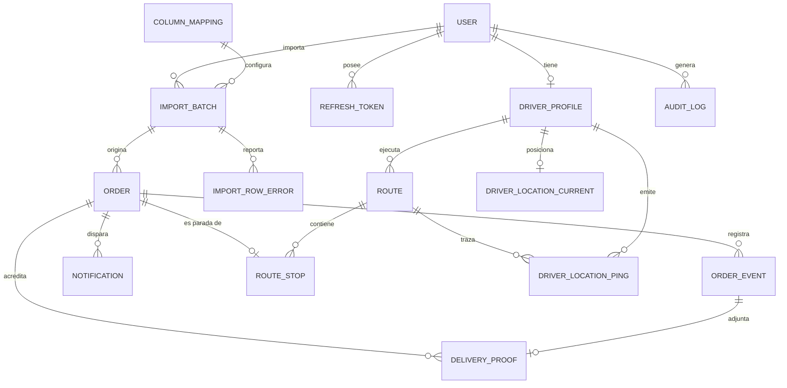

# 2. Modelo de Base de Datos

PostgreSQL 16 · Prisma ORM · Zona horaria: **todo se almacena en UTC**, se presenta en `America/Lima` (UTC-5, sin horario de verano).

## 2.1 Diagrama entidad-relación



## 2.2 Enumeraciones

```prisma
enum UserRole        { ADMIN  DRIVER }

enum OrderStatus {
  PENDIENTE          // importado, sin asignar
  ASIGNADO           // en una ruta guardada, aún no despachada
  EN_RUTA            // el motorizado inició ruta
  INTENTO_ENTREGA    // no se pudo entregar, sigue vivo
  REPROGRAMADO       // reagendado para otra fecha
  ENTREGADO          // terminal
  CANCELADO          // terminal
}

enum RouteStatus     { BORRADOR  ASIGNADA  EN_PROGRESO  COMPLETADA  CANCELADA }
enum RouteStopStatus { PENDIENTE  EN_CAMINO  COMPLETADA  FALLIDA  OMITIDA }

enum OrderEventType {
  IMPORTADO  ASIGNADO  REASIGNADO  RUTA_INICIADA  EN_CAMINO
  INTENTO_FALLIDO  ENTREGADO  REPROGRAMADO  CANCELADO
  EDITADO  COMENTARIO  NOTIFICACION_ENVIADA
}

enum NotificationChannel { WHATSAPP  EMAIL  SMS }
enum NotificationStatus  { PENDIENTE  ENVIANDO  ENVIADO  ENTREGADO  LEIDO  FALLIDO  DESCARTADO }
enum ImportStatus        { CARGANDO  VALIDADO  IMPORTANDO  COMPLETADO  FALLIDO  CANCELADO }
enum GeocodeStatus       { PENDIENTE  OK  APROXIMADO  FALLIDO  MANUAL }
enum FailureReason {
  CLIENTE_AUSENTE  DIRECCION_INCORRECTA  CLIENTE_RECHAZA  ZONA_PELIGROSA
  SIN_ACCESO  FUERA_DE_HORARIO  DATOS_INCOMPLETOS  OTRO
}
```

## 2.3 Tablas — identidad y acceso

### `user`
| Campo | Tipo | Notas |
|---|---|---|
| `id` | uuid PK | |
| `email` | citext UNIQUE | insensible a mayúsculas |
| `passwordHash` | text | Argon2id |
| `fullName` | text | |
| `phone` | text | E.164 (`+51…`) |
| `role` | UserRole | |
| `isActive` | boolean | baja lógica, nunca borrado físico |
| `lastLoginAt` | timestamptz | |
| `createdAt` / `updatedAt` | timestamptz | |

### `driver_profile`
`userId` PK/FK · `documentId` (DNI) · `licensePlate` · `vehicleType` · `maxStopsPerRoute` int · `isAvailable` boolean · `gpsConsentAt` timestamptz · `createdAt`

> `gpsConsentAt` es requisito legal: guarda cuándo el motorizado aceptó compartir ubicación.

### `refresh_token`
`id` · `userId` FK · `tokenHash` (SHA-256, nunca el token) · `familyId` uuid · `expiresAt` · `revokedAt` · `replacedById` · `userAgent` · `ip`
→ **Índice** `(userId, revokedAt)`. La detección de reuso revoca por `familyId`.

## 2.4 Tablas — importación

### `column_mapping`
`id` · `name` · `mapping` **jsonb** · `isDefault` boolean · `createdById` · `createdAt`

```jsonc
// Ejemplo: mapea encabezados del Excel de VTEX a campos del dominio
{
  "orderNumber":   "Número de pedido",
  "customerName":  "Nombre del cliente",
  "customerPhone": "Teléfono",
  "address":       "Dirección de envío",
  "district":      "Distrito",
  "province":      "Provincia",
  "department":    "Departamento",
  "notes":         "Observaciones",
  "orderDate":     "Fecha de creación"
}
```
> Resuelve tu requisito *"si cambia el orden de las columnas, debe permitir configurarlas"*: el mapeo es **por nombre de encabezado, no por posición**, así que reordenar columnas nunca rompe la importación. Sólo si VTEX **renombra** un encabezado hace falta ajustar el mapeo, y la UI lo detecta y lo pide.

### `import_batch`
`id` · `filename` · `fileHash` (SHA-256 — detecta reimportar el mismo archivo) · `uploadedById` · `columnMappingId` · `status` ImportStatus · `totalRows` · `validRows` · `importedRows` · `duplicateRows` · `errorRows` · `startedAt` · `completedAt` · `errorMessage`

### `import_row_error`
`id` · `batchId` FK · `rowNumber` · `field` · `code` · `message` · `rawRow` jsonb
→ Alimenta la vista previa de errores y el CSV de rechazados descargable.

## 2.5 Tablas — núcleo operativo

### `order`
| Campo | Tipo | Notas |
|---|---|---|
| `id` | uuid PK | |
| `orderNumber` | text | **UNIQUE parcial** `WHERE deletedAt IS NULL` |
| `importBatchId` | uuid FK | |
| `customerName` | text | |
| `customerPhone` | text | tal como vino |
| `customerPhoneE164` | text | normalizado `+51XXXXXXXXX` — se usa para WhatsApp |
| `customerEmail` | text? | |
| `address` | text | |
| `addressReference` | text? | referencia editable por el admin |
| `district` / `province` / `department` | text | indexados para KPIs por distrito |
| `lat` / `lng` | decimal(10,7)? | |
| `geocodeStatus` | GeocodeStatus | |
| `notes` | text? | observaciones de VTEX |
| `orderDate` | timestamptz | fecha del pedido en VTEX |
| `status` | OrderStatus | |
| `assignedDriverId` | uuid? FK | |
| `routeId` | uuid? FK | |
| `deliveryAttempts` | int default 0 | |
| `lastFailureReason` | FailureReason? | |
| `rescheduledFor` | date? | |
| `trackingToken` | text UNIQUE | `nanoid(32)` |
| `trackingExpiresAt` | timestamptz? | | 
| `slaDueAt` | timestamptz | `orderDate + SLA_HOURS` (configurable) |
| **`importedAt`** | timestamptz | ⟵ read-model KPI |
| **`assignedAt`** | timestamptz? | ⟵ read-model KPI |
| **`dispatchedAt`** | timestamptz? | ⟵ salida a reparto |
| **`firstAttemptAt`** | timestamptz? | ⟵ primer intento |
| **`deliveredAt`** | timestamptz? | ⟵ entrega |
| `cancelledAt` | timestamptz? | |
| `createdAt` / `updatedAt` / `deletedAt` | timestamptz | borrado lógico |

> Los cinco campos marcados son el **read-model** del ADR-004: se escriben en la misma transacción que el `order_event` correspondiente y hacen que todos los indicadores del anexo A1 sean restas entre columnas de una sola tabla.

### `order_event` — log inmutable
`id` · `orderId` FK · `type` OrderEventType · `fromStatus` · `toStatus` · `actorId` FK? · `actorRole` · `lat` · `lng` · `note` text? · `failureReason`? · `metadata` jsonb · `occurredAt` timestamptz · `createdAt`

Sin `UPDATE` ni `DELETE`: se revoca el permiso a nivel de rol de base de datos. Es la evidencia de auditoría y la fuente para reconstruir el read-model.

### `route`
`id` · `code` (`RUT-20260803-01`) · `driverId` FK · `createdById` FK · `scheduledDate` date · `status` RouteStatus · `plannedStops` int · `completedStops` int · `failedStops` int · `startedAt` · `completedAt` · `totalDistanceM` int? · `notes` · `createdAt` / `updatedAt`

### `route_stop`
`id` · `routeId` FK · `orderId` FK **UNIQUE** · `sequence` int · `status` RouteStopStatus · `etaAt` timestamptz? · `arrivedAt` · `completedAt`
→ **UNIQUE `(routeId, sequence)`**. `sequence` responde directamente a tu requisito *"cantidad de entregas antes de la suya"*: se cuentan las paradas de la misma ruta con `sequence <` la del cliente y `status = PENDIENTE`.

### `driver_location_current` — tabla caliente
`driverId` PK · `routeId` · `lat` · `lng` · `accuracyM` · `speedMps` · `headingDeg` · `batteryPct` · `recordedAt` · `updatedAt`
→ Una fila por motorizado, siempre `UPDATE`. Espejo persistente del valor en Redis (respaldo ante reinicio de Redis).

### `driver_location_ping` — histórico, particionada por mes
`id` · `driverId` · `routeId` · `lat` · `lng` · `accuracyM` · `speedMps` · `headingDeg` · `recordedAt` · `receivedAt`

```sql
CREATE TABLE driver_location_ping (...) PARTITION BY RANGE (recordedAt);
-- Cron mensual: crea la partición del mes siguiente y DETACH+DROP de las > 90 días.
```

### `delivery_proof`
`id` · `orderId` FK · `eventId` FK · `photoUrls` text[] · `signatureUrl` text? · `receivedByName` · `receivedByDocument` · `lat` · `lng` · `accuracyM` · `capturedAt` · `deviceInfo` jsonb

### `notification`
`id` · `orderId` FK · `channel` · `templateKey` · `recipient` · `payload` jsonb · `status` NotificationStatus · `providerMessageId` · `errorCode` · `errorMessage` · `attempts` int · `scheduledAt` · `sentAt` · `deliveredAt` · `readAt` · `createdAt`
→ **UNIQUE `(orderId, templateKey, channel)`** en las plantillas de evento único (ej. `pedido_en_ruta`) para **garantizar idempotencia**: nunca se envía dos veces el mismo WhatsApp aunque el job se reintente.

### `audit_log`
`id` · `actorId` · `action` · `entity` · `entityId` · `before` jsonb · `after` jsonb · `ip` · `userAgent` · `createdAt`

### `app_setting`
`key` PK · `value` jsonb · `updatedById` · `updatedAt`
Claves: `sla_hours` (24), `gps_ping_interval_ms` (10000), `tracking_link_ttl_hours` (48), `whatsapp_templates`, `working_hours`, `max_stops_per_route`.

### `kpi_daily` — rollup pre-agregado
`date` · `driverId?` · `district?` (PK compuesta) · `delivered` · `pending` · `rescheduled` · `attempts` · `cancelled` · `avgAssignSec` · `avgDispatchSec` · `avgDeliverySec` · `avgTotalSec` · `sameDayPct` · `within24hPct` · `slaBreachPct` · `computedAt`
→ Recalculado por cron a las 00:15 (Lima) del día anterior + refresco incremental cada 15 min para el día en curso.

## 2.6 Índices (dirigidos a las consultas calientes)

```sql
-- 1) Bandeja de pedidos del admin (filtro por estado + fecha)
CREATE INDEX ON "order" (status, "orderDate" DESC) WHERE "deletedAt" IS NULL;
-- 2) Pedidos de un motorizado (guard de ownership)
CREATE INDEX ON "order" ("assignedDriverId", status) WHERE "deletedAt" IS NULL;
-- 3) Resolución del enlace público (debe ser O(1))
CREATE UNIQUE INDEX ON "order" ("trackingToken");
-- 4) Anti-duplicado de importación
CREATE UNIQUE INDEX ON "order" ("orderNumber") WHERE "deletedAt" IS NULL;
-- 5) KPIs por distrito
CREATE INDEX ON "order" (district, "deliveredAt") WHERE status = 'ENTREGADO';
-- 6) Timeline del pedido
CREATE INDEX ON "order_event" ("orderId", "occurredAt" DESC);
-- 7) Traza de ruta
CREATE INDEX ON "driver_location_ping" ("routeId", "recordedAt" DESC);
-- 8) Reintentos de notificación
CREATE INDEX ON "notification" (status, "scheduledAt") WHERE status IN ('PENDIENTE','FALLIDO');
-- 9) Búsqueda por texto (cliente / dirección / nº pedido)
CREATE INDEX ON "order" USING gin (
  to_tsvector('spanish', "orderNumber" || ' ' || "customerName" || ' ' || address)
);
```

## 2.7 Invariantes del dominio (garantizadas por código + constraint)

1. Un pedido `ENTREGADO` o `CANCELADO` **no admite más transiciones** (estados terminales).
2. `routeId` no nulo ⟹ `assignedDriverId` = `route.driverId` (consistencia asignación/ruta).
3. Una `route` sólo pasa a `EN_PROGRESO` si tiene ≥ 1 parada y su motorizado no tiene otra ruta en progreso.
4. `deliveredAt` no nulo ⟺ `status = ENTREGADO`.
5. `deliveryAttempts` es monótono creciente; nunca decrece.
6. Todo cambio de `status` produce exactamente un `order_event` en la misma transacción.
7. Un pedido no puede aparecer en dos `route_stop` activos (UNIQUE en `orderId`).

## 2.8 Retención de datos (Ley N° 29733)

| Dato | Retención | Acción |
|---|---|---|
| `driver_location_ping` | 90 días | Partición `DETACH` + `DROP` |
| Enlace de tracking | 48 h post-entrega | Token invalidado, página muestra "expirado" |
| Fotos y firmas | 12 meses | Purga en Cloudinary vía job |
| `order` / `order_event` | 5 años | Retención contable |
| `audit_log` | 2 años | |
| Usuario dado de baja | Inmediato | Anonimización de PII, se conservan los IDs para integridad referencial |
