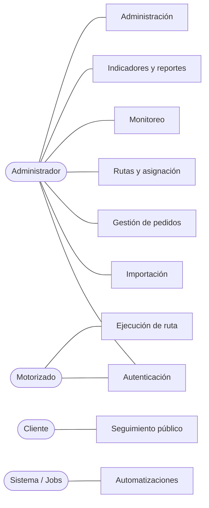

# 3. Casos de uso

Nomenclatura: `CU-XX`. Cada caso de uso corresponde a **una clase** en `application/use-cases/`, con su prueba unitaria.

## 3.1 Mapa de actores

---

## 3.2 Autenticación y sesión

| ID | Caso de uso | Actor | Precondición | Postcondición |
|---|---|---|---|---|
| CU-01 | Iniciar sesión | Admin, Motorizado | Usuario activo | Access token 15 min + refresh cookie; `lastLoginAt` actualizado; audit log |
| CU-02 | Renovar sesión | Ambos | Refresh válido no usado | Nuevo par de tokens; el anterior queda revocado |
| CU-03 | Cerrar sesión | Ambos | Sesión activa | Familia de refresh revocada; cookie borrada |
| CU-04 | Recuperar contraseña | Ambos | Email registrado | Email con token de 1 uso, 30 min (Resend) |
| CU-05 | Cambiar contraseña | Ambos | Contraseña actual correcta | Hash actualizado; **todas** las sesiones revocadas |

**Reglas:** 5 intentos fallidos por email+IP en 15 min → bloqueo temporal. La respuesta de "email no existe" y "contraseña incorrecta" es idéntica (anti-enumeración de usuarios).

---

## 3.3 Importación de pedidos (CU-10 …)

### CU-10 — Cargar archivo VTEX
**Actor:** Administrador
**Flujo principal:**
1. Sube `.xlsx`, `.xls` o `.csv` (máx. 10 MB, máx. 5.000 filas).
2. El sistema calcula el `fileHash`; si coincide con un lote ya importado, **advierte** ("este archivo ya fue importado el 03/08 a las 08:14") y permite continuar o cancelar.
3. Detecta encabezados y los compara contra el `column_mapping` por defecto.
4. Si todos los campos requeridos se resuelven → pasa a CU-11. Si no → CU-12.

**Flujos alternos:** archivo corrupto o vacío → error explicativo; codificación no UTF-8 (CSV latin1 de Excel) → se detecta y transcodifica automáticamente; separador `;` vs `,` → autodetección.

### CU-11 — Vista previa y validación
El sistema muestra una tabla con **todas** las filas y su veredicto por fila:

| Validación | Severidad | Comportamiento |
|---|---|---|
| Nº de pedido vacío | 🔴 Error | Fila no importable |
| Nº de pedido duplicado **dentro del archivo** | 🔴 Error | Se conserva la primera, se marcan las siguientes |
| Nº de pedido **ya existente en BD** | 🟡 Duplicado | Se omite por defecto; opción "actualizar existente" |
| Teléfono vacío | 🟡 Advertencia | Importa, pero el pedido no podrá notificarse — se marca visualmente |
| Teléfono con formato inválido | 🟡 Advertencia | Se intenta normalizar a E.164 (`+51`); si falla, se marca |
| Dirección vacía | 🔴 Error | Fila no importable |
| Distrito vacío | 🟡 Advertencia | Importa; afecta el KPI por distrito |
| Fecha no parseable | 🟡 Advertencia | Se usa la fecha de importación |

Cabecera con contadores: `Total · Válidas · Advertencias · Errores · Duplicadas`. El admin puede **editar celdas en línea** en la vista previa antes de confirmar, y descargar el CSV de filas rechazadas.

### CU-12 — Configurar mapeo de columnas
Cuando un encabezado no se reconoce, la UI presenta cada campo del dominio con un desplegable de los encabezados detectados y una sugerencia por similitud (distancia de Levenshtein normalizada). El mapeo se puede **guardar con nombre** y marcar como predeterminado.

### CU-13 — Confirmar importación
Transacción: crea `import_batch`, inserta los `order` válidos con `status = PENDIENTE`, `importedAt = now()`, genera `trackingToken`, escribe un `order_event` `IMPORTADO` por pedido, registra los errores en `import_row_error`. **Todo o nada.** Encola el job de geocodificación (CU-90).

### CU-14 — Consultar historial de importaciones
Lista de lotes con métricas, autor, y acceso al detalle de errores.

### CU-15 — Revertir importación
Sólo si **ningún** pedido del lote fue asignado. Borrado lógico de todo el lote. Auditado.

---

## 3.4 Gestión de pedidos (CU-20 …)

| ID | Caso de uso | Notas |
|---|---|---|
| CU-20 | Listar pedidos | Filtros: estado, fecha, distrito, motorizado, lote, texto libre. Paginación por cursor. Vista tabla o tarjetas |
| CU-21 | Ver detalle de pedido | Datos + timeline de eventos + notificaciones + prueba de entrega + mapa |
| CU-22 | Editar pedido | Campos editables: cliente, teléfono, dirección, referencia, distrito, observaciones, coordenadas. Cada edición → `order_event` `EDITADO` con diff en `metadata` |
| CU-23 | Ajustar ubicación en el mapa | Arrastrar el pin; `geocodeStatus = MANUAL` |
| CU-24 | Cancelar pedido | Requiere motivo. Estado terminal. Notifica al cliente si estaba en ruta |
| CU-25 | Eliminar pedido | **Borrado lógico** (`deletedAt`). Bloqueado si está `EN_RUTA` |
| CU-26 | Añadir comentario interno | No visible para el cliente |
| CU-27 | Reenviar enlace de tracking | Reenvía el WhatsApp; rate-limit 3/hora por pedido |
| CU-28 | Exportar pedidos filtrados | Excel / CSV |

---

## 3.5 Rutas y asignación (CU-30 …)

### CU-30 — Crear ruta con asignación masiva
**Flujo principal:**
1. El admin filtra pedidos `PENDIENTE` (típicamente por distrito).
2. Selecciona varios (checkbox, *shift+click* para rango, "seleccionar todos los filtrados").
3. Botón **Asignar** → elige motorizado y fecha.
4. El sistema valida: motorizado activo, pedidos no asignados a otra ruta activa, límite `maxStopsPerRoute`.
5. Crea `route` (`ASIGNADA`), crea un `route_stop` por pedido con `sequence` según el orden mostrado, actualiza cada pedido a `ASIGNADO` con `assignedAt = now()`, y escribe un `order_event` `ASIGNADO`.

**Todo en una transacción.** Si un pedido fue asignado por otro admin en paralelo, la operación completa falla con detalle de los conflictos (control de concurrencia optimista sobre `order.updatedAt`).

| ID | Caso de uso | Notas |
|---|---|---|
| CU-31 | Reordenar paradas | Drag & drop; recalcula `sequence`. Sugerencia opcional de orden óptimo (ver doc 10) |
| CU-32 | Cambiar motorizado de una ruta | Permitido en `ASIGNADA` y `EN_PROGRESO`. Notifica a ambos motorizados. Evento `REASIGNADO` |
| CU-33 | Quitar un pedido de la ruta | Vuelve a `PENDIENTE`; se recompactan las secuencias |
| CU-34 | Añadir pedidos a ruta existente | Se anexan al final |
| CU-35 | Cancelar ruta | Todos los pedidos no entregados vuelven a `PENDIENTE` |
| CU-36 | Listar rutas | Por fecha, motorizado, estado |
| CU-37 | Imprimir hoja de ruta | PDF con paradas, direcciones, teléfonos y códigos QR |

---

## 3.6 Ejecución de ruta — Motorizado (CU-40 …)

### CU-40 — Iniciar ruta
**Precondiciones:** ruta `ASIGNADA` del día asignada a él; permiso de geolocalización concedido; sin otra ruta en progreso.

**El sistema, en una sola operación:**
1. `route.status → EN_PROGRESO`, `startedAt = now()`.
2. Todos los pedidos de la ruta → `EN_RUTA`, `dispatchedAt = now()`.
3. Un `order_event` `RUTA_INICIADA` por pedido.
4. Activa la emisión de GPS cada 10 s.
5. **Encola** una notificación WhatsApp por pedido con el enlace de tracking (job asíncrono con reintentos; el arranque de ruta **no** se bloquea si WhatsApp falla).
6. Emite por WebSocket a `admin:live`.

### CU-41 — Compartir ubicación GPS
`watchPosition` con `enableHighAccuracy`. Emite cada 10 s o cada 25 m de desplazamiento. Descarta lecturas con `accuracy > 100 m`. **Buffer offline en IndexedDB**: sin señal, acumula y reenvía al recuperar conexión. Se detiene automáticamente al completar la ruta.

| ID | Caso de uso | Detalle |
|---|---|---|
| CU-42 | Ver mis pedidos del día | Sólo los suyos, ordenados por `sequence`, con la parada actual destacada |
| CU-43 | Abrir en Google Maps | Deep link `https://www.google.com/maps/dir/?api=1&destination=lat,lng` (o dirección si no hay coordenadas) |
| CU-44 | Llamar al cliente | `tel:` |
| CU-45 | Enviar WhatsApp manual | `https://wa.me/51XXXXXXXXX?text=…` con mensaje precargado |
| CU-46 | Marcar "en camino a esta parada" | `route_stop → EN_CAMINO`; el cliente lo ve en su tracking |
| CU-47 | **Registrar entrega exitosa** | Foto (≥1, obligatoria), firma en canvas (opcional/configurable), nombre y DNI de quien recibe, comentario, GPS y hora automáticos. → `ENTREGADO`, `deliveredAt`, `delivery_proof`, notificación al cliente |
| CU-48 | **Registrar intento fallido** | Motivo (lista tipificada) + foto opcional + comentario. `deliveryAttempts++`, `firstAttemptAt` si es el primero. → `INTENTO_ENTREGA` |
| CU-49 | **Reprogramar** | Motivo + nueva fecha. → `REPROGRAMADO`, `rescheduledFor`. Sale de la ruta actual |
| CU-50a | Finalizar ruta | Requiere que toda parada esté resuelta (o justificar las omitidas). `COMPLETADA`, detiene GPS |
| CU-50b | Modo offline | Todas las acciones de entrega se encolan en IndexedDB y se sincronizan al reconectar, con indicador visible de "N acciones pendientes de sincronizar" |

---

## 3.7 Monitoreo en tiempo real — Admin (CU-50 …)

| ID | Caso de uso | Detalle |
|---|---|---|
| CU-51 | Mapa en vivo | Todos los motorizados en ruta, marcadores con foto/inicial, color por estado, agrupamiento por cercanía |
| CU-52 | Panel lateral de ruta | Paradas, progreso, tiempo transcurrido, ETA de la ruta |
| CU-53 | Timeline de un pedido | Cronología completa con actor, hora y ubicación |
| CU-54 | Alertas operativas | Motorizado sin ping > 15 min · ruta sin iniciar pasada la hora objetivo · pedido en riesgo de SLA · intentos fallidos repetidos |
| CU-55 | Reproducir traza de ruta | Animación del recorrido histórico sobre el mapa |

---

## 3.8 Indicadores y reportes (CU-60 …)

| ID | Caso de uso |
|---|---|
| CU-60 | Dashboard con tarjetas de KPI del día |
| CU-61 | Gráficos: entregas por día, por hora, tiempo promedio diario/mensual, por distrito, por motorizado |
| CU-62 | Ranking de motorizados (entregas, tiempo promedio, % cumplimiento) |
| CU-63 | Comparativa entre períodos |
| CU-64 | Exportar a Excel (multi-hoja con formato) |
| CU-65 | Exportar a PDF (con gráficos renderizados y logo) |
| CU-66 | Exportar a CSV (datos crudos) |
| CU-67 | Reporte programado por email (opcional, cierre diario a las 20:00) |

---

## 3.9 Administración (CU-70 …)

| ID | Caso de uso |
|---|---|
| CU-70 | CRUD de usuarios y motorizados |
| CU-71 | Activar / desactivar motorizado |
| CU-72 | Editar plantillas de mensajes (con vista previa de variables) |
| CU-73 | Configurar SLA, intervalo de GPS, horario laboral, TTL del enlace |
| CU-74 | Gestionar mapeos de columnas |
| CU-75 | Consultar log de auditoría |
| CU-76 | Ver estado del sistema (colas, errores de notificación, salud) |

---

## 3.10 Seguimiento público — Cliente (CU-80 …)

### CU-80 — Consultar seguimiento
**Precondición:** token válido y no expirado. **Sin autenticación.**

Muestra: nº de pedido, estado actual con barra de progreso, mapa con la posición aproximada del motorizado, nombre de pila del motorizado, hora estimada de llegada, **cuántas entregas hay antes de la suya**, hora de última actualización, e historial de estados. Al entregarse: hora exacta de entrega y confirmación.

**Flujos alternos:** token inválido → página neutra "enlace no válido o expirado" (sin filtrar si el pedido existe); pedido aún no despachado → estado sin mapa; ruta finalizada → mapa retirado, resumen final.

| ID | Caso de uso |
|---|---|
| CU-81 | Actualización automática (WebSocket, fallback polling 10 s) |
| CU-82 | Contactar por WhatsApp al comercio |
| CU-83 | Calificar la entrega (1–5 estrellas + comentario) — *ver doc 10* |

---

## 3.11 Automatizaciones del sistema (CU-90 …)

| ID | Automatización | Disparador |
|---|---|---|
| CU-90 | Geocodificar direcciones | Tras importar (job en lote, con caché por dirección normalizada) |
| CU-91 | Enviar notificaciones | Cambio de estado → cola BullMQ con reintento exponencial (5 intentos) |
| CU-92 | Recalcular `kpi_daily` | Cron 00:15 Lima + incremental cada 15 min |
| CU-93 | Expirar enlaces de tracking | Cron horario |
| CU-94 | Purgar pings > 90 días | Cron mensual (DETACH de partición) |
| CU-95 | Detectar SLA en riesgo | Cron cada 15 min → alerta en dashboard |
| CU-96 | Cerrar rutas huérfanas | Cron: ruta `EN_PROGRESO` sin pings > 3 h → alerta al admin |
| CU-97 | Conciliar estado de WhatsApp | Webhook de Meta → actualiza `notification.status` a ENTREGADO/LEIDO |
