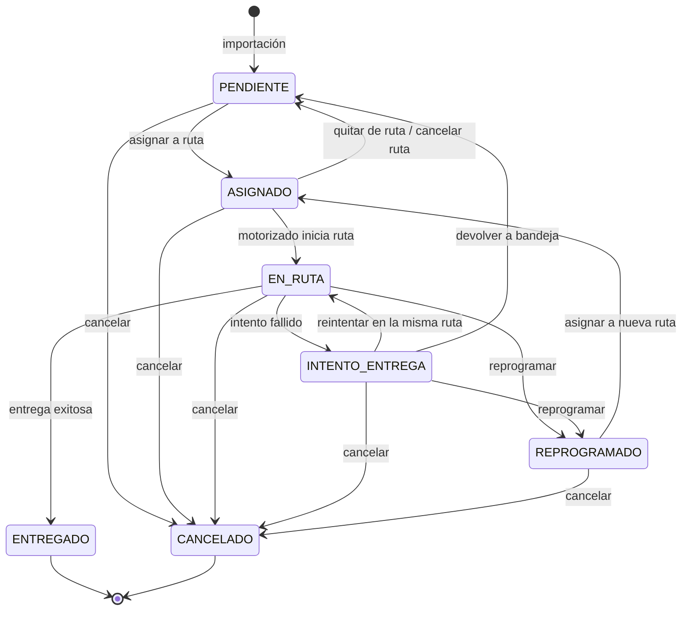
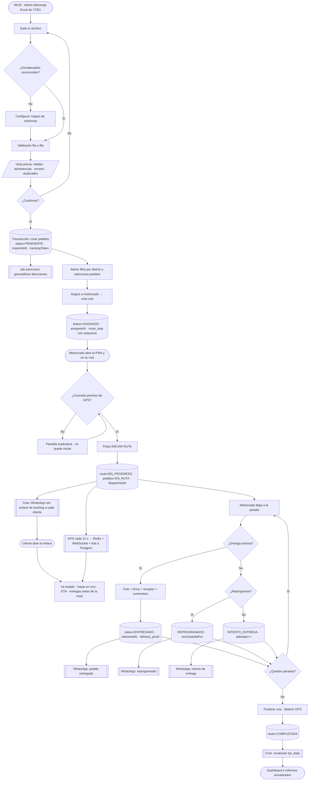
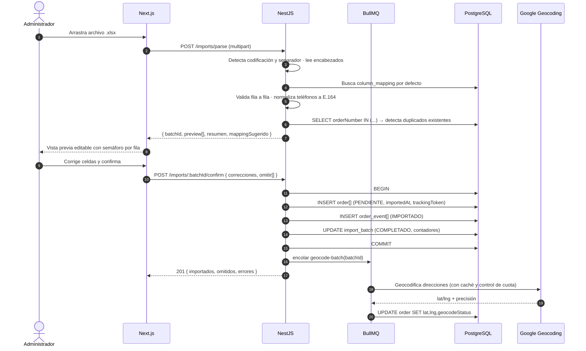
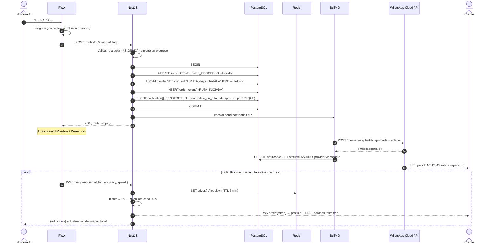
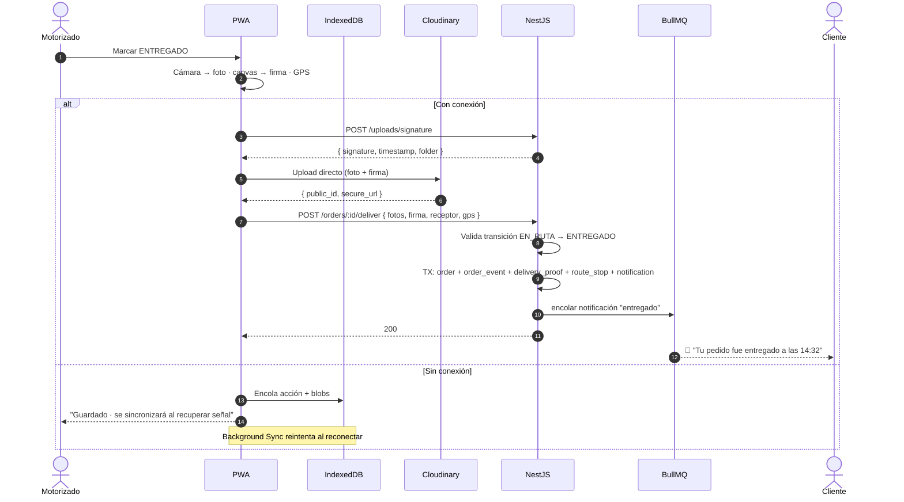
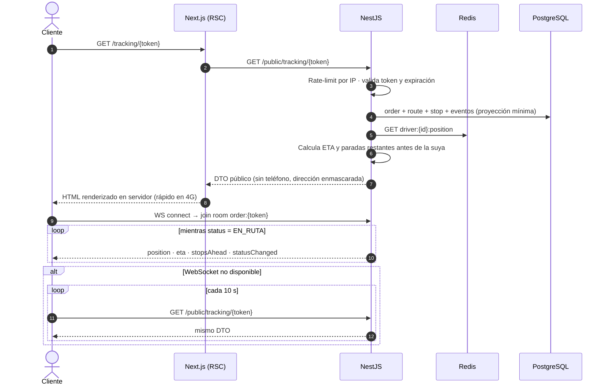
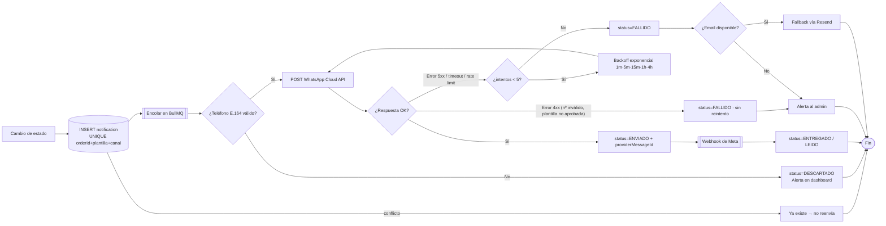

# 4. Diagramas de flujo

## 4.1 Máquina de estados del pedido

Toda transición está codificada en `domain/order-state-machine.ts`. Cualquier transición no listada lanza `InvalidStateTransitionError` — **no existe forma de saltarse un estado desde ninguna capa**.

**Matriz de permisos por transición**

| Desde → Hacia | ADMIN | DRIVER | Requiere |
|---|:--:|:--:|---|
| PENDIENTE → ASIGNADO | ✅ | ❌ | motorizado + ruta |
| ASIGNADO → EN_RUTA | ✅ | ✅ | permiso GPS activo |
| EN_RUTA → ENTREGADO | ✅ | ✅ | ≥1 foto + GPS |
| EN_RUTA → INTENTO_ENTREGA | ✅ | ✅ | motivo tipificado |
| EN_RUTA → REPROGRAMADO | ✅ | ✅ | motivo + nueva fecha |
| * → CANCELADO | ✅ | ❌ | motivo |

---

## 4.2 Flujo operativo diario (extremo a extremo)

---

## 4.3 Secuencia — Importación

---

## 4.4 Secuencia — Inicio de ruta y notificación al cliente

---

## 4.5 Secuencia — Registro de entrega (con soporte offline)

---

## 4.6 Secuencia — Página pública de tracking

---

## 4.7 Flujo de notificaciones (con reintentos e idempotencia)

