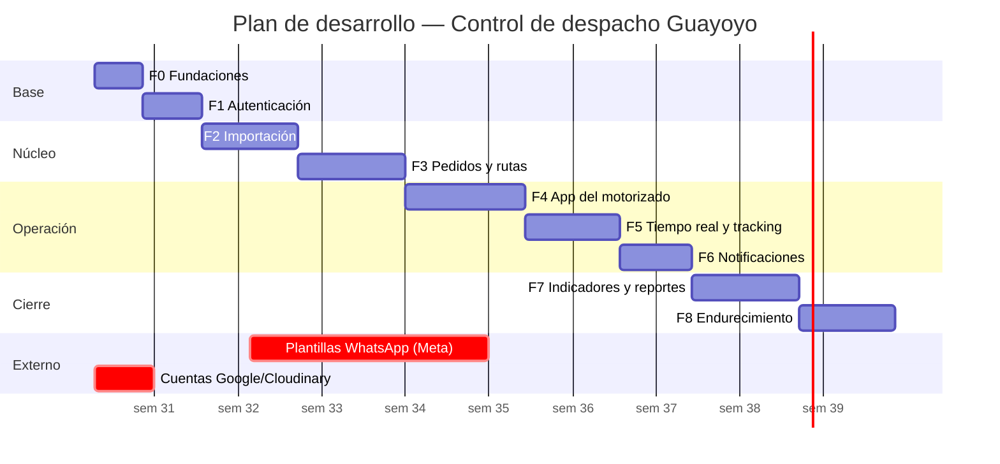

# 8. Plan de desarrollo por fases

Cada fase termina en un estado **desplegable y demostrable**. No hay fases que sólo dejen "código a medias": esa es la diferencia entre un plan profesional y una lista de tareas.

**Estimación total: 11–13 semanas** para un desarrollador full-stack senior a tiempo completo. Con dos desarrolladores en paralelo (uno backend, uno frontend) a partir de la Fase 2: **7–8 semanas**.

---

## Fase 0 · Fundaciones — 4 días

| Entregable | Detalle |
|---|---|
| Monorepo | pnpm workspaces + Turborepo + TypeScript strict |
| Calidad | ESLint (con regla de fronteras de arquitectura), Prettier, Husky, lint-staged, commitlint |
| Docker | `docker compose up` levanta Postgres, Redis, API, Web, Mailpit, Adminer |
| Prisma | Esquema completo del documento 2, migración inicial, `seed.ts` |
| `packages/shared` | Enums, esquemas Zod, contratos de API y WebSocket |
| `packages/ui` | Tokens de tema, modo claro/oscuro, primitivas base |
| CI | GitHub Actions: lint → typecheck → test → build |
| Observabilidad | Pino, correlationId, filtro de errores RFC 7807, `/health` |

✅ **Criterio de salida:** un desarrollador nuevo clona, ejecuta un comando y tiene el entorno completo funcionando.

---

## Fase 1 · Autenticación y usuarios — 5 días

Módulo `auth` completo (login, refresh con rotación y detección de reuso, logout, recuperación de contraseña), módulo `users`, guards de rol y de ownership, pantalla de login, middleware de protección de rutas, layouts de admin y de motorizado, conmutador de tema.

✅ **Salida:** admin y motorizado inician sesión y ven su layout correspondiente. Suite de tests de seguridad de auth en verde.

---

## Fase 2 · Importación de pedidos — 8 días

Parsers XLSX/CSV con detección de codificación y separador · normalizador de teléfonos a E.164 Perú · validador de dominio (todas las reglas del CU-11) · mapeo de columnas por nombre con sugerencia por similitud · asistente de 3 pasos en la UI con vista previa editable · confirmación transaccional · historial y reversión de lotes · geocodificación asíncrona con caché.

✅ **Salida:** subes un Excel real de VTEX y los pedidos quedan en la base de datos, validados y geocodificados.
🎯 **Hito de negocio:** primera demostración con datos reales.

---

## Fase 3 · Gestión de pedidos y rutas — 9 días

Máquina de estados del pedido con sus tests exhaustivos · CRUD de pedidos con auditoría y borrado lógico · tabla avanzada (TanStack Table) con filtros, orden, columnas configurables y selección masiva · detalle del pedido con timeline · pantalla de creación de rutas con dos paneles y drag & drop · asignación masiva transaccional con control de concurrencia · CRUD de motorizados · hoja de ruta en PDF.

✅ **Salida:** el flujo importar → filtrar → asignar → ruta guardada está completo.

---

## Fase 4 · App del motorizado y ejecución — 10 días

PWA (manifest, service worker, instalable) · pantalla de permiso de GPS con consentimiento · "Mi ruta de hoy" · iniciar y finalizar ruta · deep links a Maps, teléfono y WhatsApp · registro de entrega con cámara, firma en canvas y subida directa firmada a Cloudinary · intento fallido y reprogramación · **cola offline en IndexedDB con Background Sync** · historial y estadísticas personales.

✅ **Salida:** un motorizado completa una ruta real de principio a fin desde su teléfono, incluso perdiendo señal.
⚠️ **Fase de mayor riesgo** — ver documento 9, R-01 y R-02. Se prueba en dispositivos físicos Android e iOS desde el primer día, no al final.

---

## Fase 5 · Tiempo real y tracking del cliente — 8 días

Gateway Socket.IO con autenticación en handshake y adaptador Redis · emisión de GPS cada 10 s con buffer y persistencia en lote · cálculo de ETA y de paradas restantes · **página pública de tracking** (SSR, mapa con marcador interpolado, degradación a polling) · mapa de monitoreo en vivo del admin · reproducción de traza histórica · alertas operativas.

✅ **Salida:** el cliente abre el enlace y ve al motorizado moverse en el mapa en tiempo real.
🎯 **Hito de negocio:** la funcionalidad diferencial del producto está viva.

---

## Fase 6 · Notificaciones — 6 días

Colas BullMQ con reintento exponencial · adaptador WhatsApp Cloud API con plantillas · adaptador Resend como respaldo · webhook de Meta con validación de firma para conciliar entregado/leído · idempotencia por constraint único · editor de plantillas con vista previa · panel de notificaciones fallidas · reenvío manual.

✅ **Salida:** los cuatro mensajes automáticos (en ruta, entregado, reprogramado, intento) llegan de forma fiable y trazable.
⏱️ **Empezar la aprobación de plantillas en Meta durante la Fase 2** — tarda de 1 a 5 días hábiles y es una dependencia externa bloqueante (documento 9, R-03).

---

## Fase 7 · Indicadores, dashboard y reportes — 9 días

Consultas SQL optimizadas de tiempos de ciclo · tabla `kpi_daily` con cron de rollup e incremental · endpoints de analítica con caché · dashboard completo con tarjetas enlazadas y actualización en vivo · gráficos (Recharts tematizados) · ranking de motorizados · comparación entre períodos · generación asíncrona de reportes Excel multi-hoja (ExcelJS), PDF con gráficos (Puppeteer) y CSV · descargas con URL firmada.

✅ **Salida:** todos los indicadores del anexo A1 se calculan y se exportan en los tres formatos.

---

## Fase 8 · Endurecimiento y salida a producción — 8 días

| Bloque | Detalle |
|---|---|
| Pruebas | Cobertura ≥ 85 % en dominio y casos de uso · integración con Testcontainers · E2E Playwright de los 5 flujos críticos |
| Seguridad | Auditoría propia, `pnpm audit`, revisión de cabeceras, prueba de fuerza bruta y de acceso cruzado entre motorizados |
| Rendimiento | Carga con k6 (500 clientes de tracking concurrentes) · revisión de planes de ejecución · presupuesto de bundle |
| Accesibilidad | axe-core en CI + revisión manual con lector de pantalla |
| Operación | Runbooks, backups con restauración probada, alertas, panel de estado |
| Documentación | README completo, guía de despliegue, manual de administrador y guía rápida del motorizado (1 página, imprimible) |
| Despliegue | Producción + staging, dominio, SSL, DNS, monitoreo |
| Piloto | 1 semana con 2 motorizados en paralelo al proceso actual antes del corte definitivo |

✅ **Salida:** aplicación en producción, con respaldo, monitoreo y personal capacitado.

---

## Cronograma

---

## Estrategia de pruebas

| Nivel | Alcance | Herramienta | Objetivo |
|---|---|---|---|
| Unitario | Máquina de estados, validador de importación, normalizador de teléfonos, cálculo de KPIs, ETA | Jest | ≥ 90 % en `domain/` |
| Casos de uso | Con puertos simulados, sin base de datos | Jest | ≥ 85 % |
| Integración | Controllers + Postgres real | Testcontainers | Rutas críticas |
| Contrato | Front y back contra `packages/shared` | tipos + Zod | 100 % de endpoints |
| E2E | Importar→asignar→iniciar→entregar→tracking · login y roles · offline del motorizado · exportación · caducidad del enlace | Playwright | 5 flujos críticos |
| Carga | 500 clientes de tracking + 50 motorizados emitiendo GPS | k6 | p95 < 300 ms |
| Accesibilidad | Todas las pantallas | axe-core | 0 violaciones críticas |

**Datos de prueba:** archivos Excel reales anonimizados de VTEX en `test/fixtures/`, incluyendo los casos feos (acentos mal codificados, teléfonos con guiones, direcciones vacías, encabezados renombrados).
